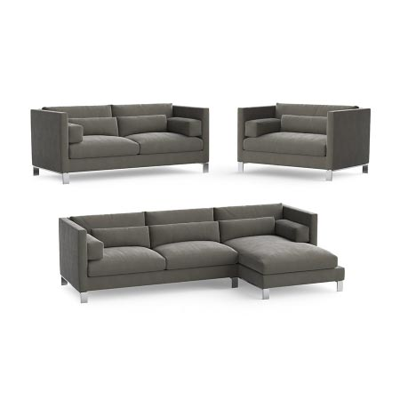
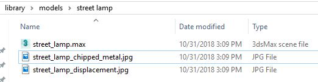

 

This Post is currently a work in progress. If you'd like to know when its finished go ahead and add your email to the mailing list at the bottom of the page!

_Where i work our bread and butter is in the production of computer generated imagery (CGI). Fully CG or partially CG images of commercial or residential buildings yet to be completed._

_These images are made up of 4 key aspects; composition, the scheme, lighting and assets. All with the final goal of advertising to potential buyers._

_Its an interesting environment to develop for, code and computer generated imagery. This series is focused on the management of our assets, current pitfalls and frustrations , and finally how we went about developing solutions._

### So what's considered an asset?

When I say assets i’m mainly referring to [3D models](https://en.wikipedia.org/wiki/3D_modeling) with textures that can be placed into a 3d modelling environments and [rendered](https://en.wikipedia.org/wiki/Rendering_(computer_graphics)) to a high resolution, realistic image. A 3d asset could be a table, car, street lamp. Honestly, anything.

&nbsp;|&nbsp;
------------- | -------------
 | 
_A render of a 3d asset courtesy of [Model Plus Model](https://www.modelplusmodel.com/)._ | _A render of a 3d scene full of assets courtesy of [The Boundary](https://www.the-boundary.com/)._  

### Great, how do i find one of these little buggers?

_The library is filled to the brim with various assets. This series of posts will only be discussing the type of asset described above, the 3d asset. But for background, other types of asset include (but not limited to) 2d imagery, footage and light information (.ies)_.

The library is accessed via local-only networked storage. Each office has a different [NAS](https://en.wikipedia.org/wiki/Network-attached_storage) in place hosting their own libraries.

We categorize 3d assets using a few different criteria.

*  **Asset type** - *is it a street lamp, a car or a table.*
*  **Asset Packs** - *Many 3d modelling companies offer packs of assets. 30 Kitchen utensils, or a pack of 10 winter trees.*
*  **General location** - *a bathroom will have the assets of a bar of soap, shower curtains and facets or an office might have work desks, phones, computers and binders.*

&nbsp;|&nbsp;
------------- | -------------
 | &nbsp;
_Typical folder structure of a model categorized by its type._ | &nbsp;

The interface to the folder structure will be whatever the 3d modelling package used, supplies. [3ds Max](https://www.autodesk.com/products/3ds-max/overview) from Autodesk for example, uses a standard Windows OS explorer dialog.

99% of the time these assets will be imported directly into the 3d modelling package. This will usually import the geometry completely with symbolic links to any related textures.

### Why go about changing the library in the first place?

The current library - even with its quirks, works. It's OK. It doesn't take too long to grok and its easy to update. But its old and bloated. More than ready for the eternal slumber. Unfortunately we needed more, more to justify spending the time on it. _It was still breathing, so it was still working._

After a bit of napkin math and some more than biased testing conditions involving a stopwatch and a list of items to find in the library.

We came to the conclusion that it takes approx 6 minutes to find an asset. Or, not *find* an asset, rather *confirm* we have it or something like it. With _n_ amount of assets per image and a desired _n_ amount of images to complete per month. The number was quite a bit higher than we had estimated.

 

~180 hours per 5 artists a month were spent on a simple question, <i>"do we have this 3d asset, or something like it?"</i>. That's upwards of 4 bread and butter sandwiches a month of artist time that is spent searching.

Unfortunately i couldn’t find any numbers online to compare such a niche query so I had to instead take the results as a sort of baseline.

Any solutions found - at minimum - should shatter those numbers or it would be a waste of time.

### Do you think that'll be enough?

With the underlying goal of drastically reducing that 180 hour number - which would be a win on its own - We collected regular users (of the library) frustrations.

* Non-ability of being able to search the library efficiently.
* Outdated, missing, duplicated or edited models and textures (overwritten).
* different models in different libraries
* confusion structure
* No one really knows whats in there

This lead to problems that can only been seen from a 1000 foot overview of the entire system.

* Zero standards in place.
* Over the years people have taken it upon themselves to sort and clean the library - heroes - however, these attempts are never actually completed. The next person then tries with injecting their ideas of how the library should be interacted with ultimately making it harder to navigate.
* Sub-libraries.

> Something that's ¼ of our deliverable shouldn't be left to rot.

### Compile collected information as baseline

All of the above took a couple weeks. It was mainly driven via coffee fueled lunch breaks and between projects, but it left us with a greater understanding of our current system and a solid list of user stories that we could use as criteria to help with the upcoming decision making process.

Upgrading the library will take time. We understand this and are in no immediate rush. Our current system has been in place for +7 years. If a new system has anywhere near that longevity we’ll be more than happy to send a little more time in the planning stage to ensure we produce a stable system.

**_This has been part 1 of an ongoing series about upgrading our asset library with the ultimate goal of reducing time-to-deliver. Thanks for reading. If you’d like to notified of the next post in the series, feel free to join the mail list!_**
