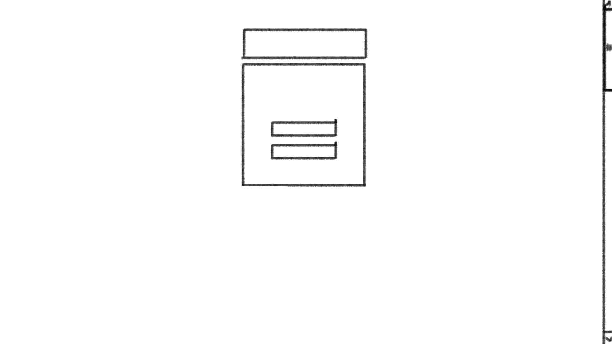
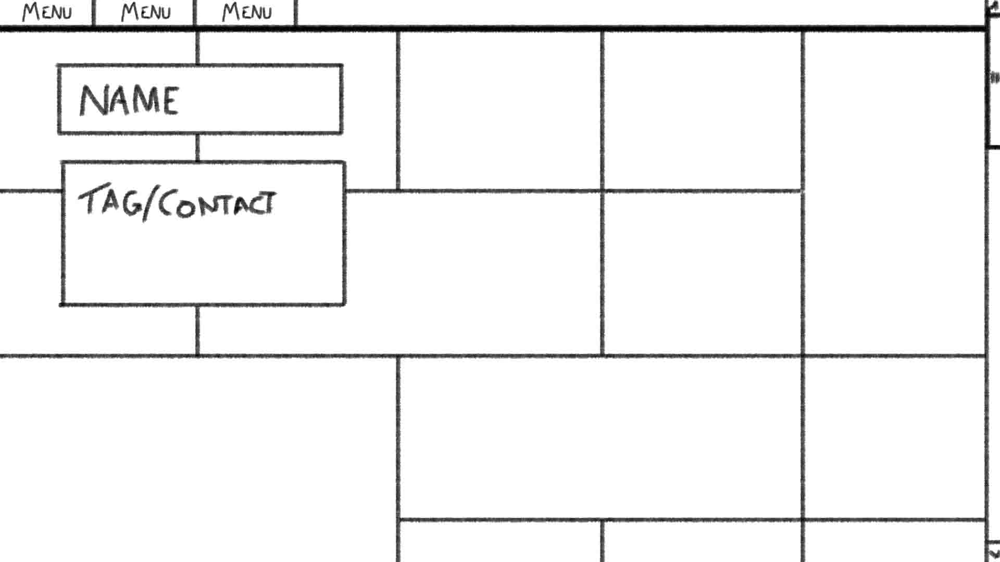
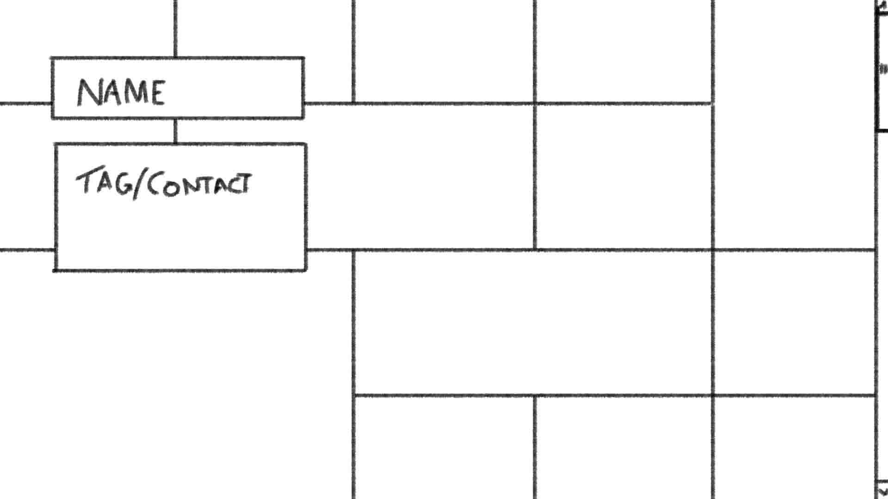
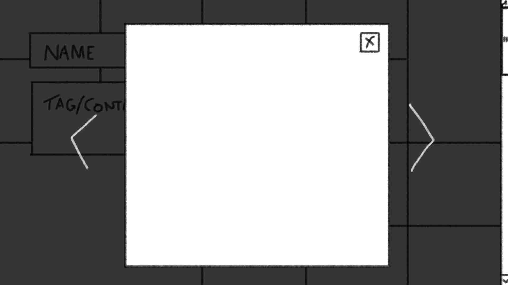
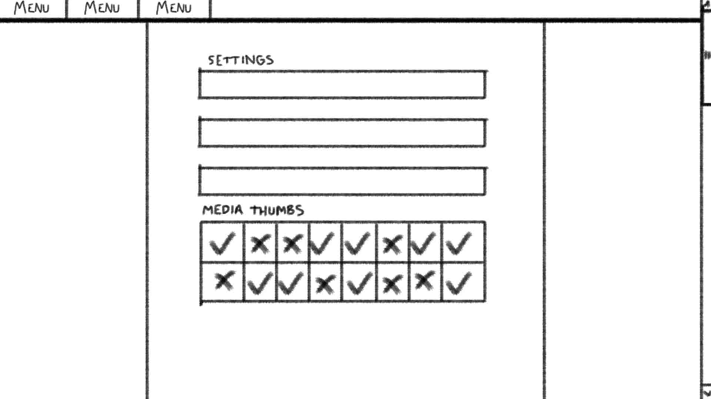

Portfo is to be a simple portfolio management web app aimed at artists of visual media for the presentation of media. Simple to use with minimal user interaction. Prebuilt themes or layouts and privacy tools.

Requirments for Completion
--

* user auth.
* user can create portofolio.
* user to upload visual media.
* user management of portoflio items, including public/private, renaming and captioning of items, deletions.
* user management of portoflio, including selection of layouts, naming and contact details, deleting of portfolio.

Functional Description
--

**Frontend Behavior**

1) First time running allows the user to create a user account. 
2) Once an account has been made the user can then progress to the creation of a portfolio.
3) The user will need to name and add contact information to their portfolio.
4) finally Selecting a theme/layout.

The user can manage the portfolio from a prebuilt admin interface at any point after the creation of portfolio. The below outlines the admin interface functionality:

* Media can be uploaded.
* Media can be renamed and captioned.
* Media can be made public/private.
* Media can be deleted.
* Theme/layout changes.
* renaming and editing of the portfolio name and contact information.

**Backend Behavior**

* ..
* ..

UI
--

* Wireframes
    * Dimensions and Constraints
    * Focused Devices
* Controls and State
    * Nav
    * high-level interation
* Represent Functionality

**Login Page**

Words words words words words words words words words words words words words words words words words words words words words words words words words words words words words words words words words words words words words words words words words words words words words words words words words words words 

**Logged User View Page**

Words words words words words words words words words words words words words words words words words words words words words words words words words words words words words words words words words words words words words words words words words words words words words words words words words words words 

**Public View Page**

Words words words words words words words words words words words words words words words words words words words words words words words words words words words words words words words words words words words words words words words words words words words words words words words words words words words 

**Model Image Page**

Words words words words words words words words words words words words words words words words words words words words words words words words words words words words words words words words words words words words words words words words words words words words words words words words words words words 

**User Admin Page**

Words words words words words words words words words words words words words words words words words words words words words words words words words words words words words words words words words words words words words words words words words words words words words words words words words words words 

Milestones
--

*Deadlines for completion and expected deliverables.*

* Communication Protocal
    * How application connects to network/server

* Functional Milestone #1
    * Deadlines per Required Function

* Alpha Application
    * Outlining Functionality per release for * pre verion 1.0

* Stability
    * QA
    * Test Schedule

* Release

High-level Design Spec
--

*Describes the architecture used in the development of a particular software product.*

* Diagram that Depicts the Envisioned Structure of the Software System
* Non-technical Language